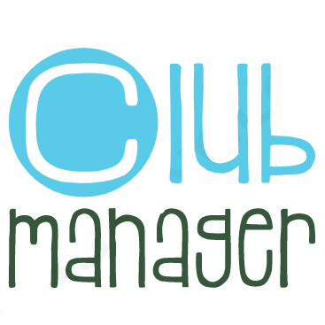

## ClubManager-IonicApp
<!-- PROJECT LOGO -->
 

  

  <h3 align="center">ClubManager Ionic App</h3>

  

    "Club Manager" est une application mobile hybride que nous avons développée dans le cadre
    du module de développement mobile hybride avec Ionic et Firebase. 
        L'objectif de cette
    application est de faciliter la gestion de clubs en permettant à chaque utilisateur de créer ou
    de rejoindre des clubs et de gérer les tâches au sein du club. Cela inclut la création et
    l'affectation des tâches aux membres, ainsi que la planification des réunions. Les utilisateurs
    reçoivent également des notifications lorsqu'une tâche leur est affectée ou lorsqu'une réunion
    est organisée.
     
     
    <a target="_blank" href="https://drive.google.com/drive/folders/1iQRKdZBFc8rpf4Dl5opbdX2CiabqeyDD"><strong>Consulter le rapport et la video demo »</strong></a>
     
  

