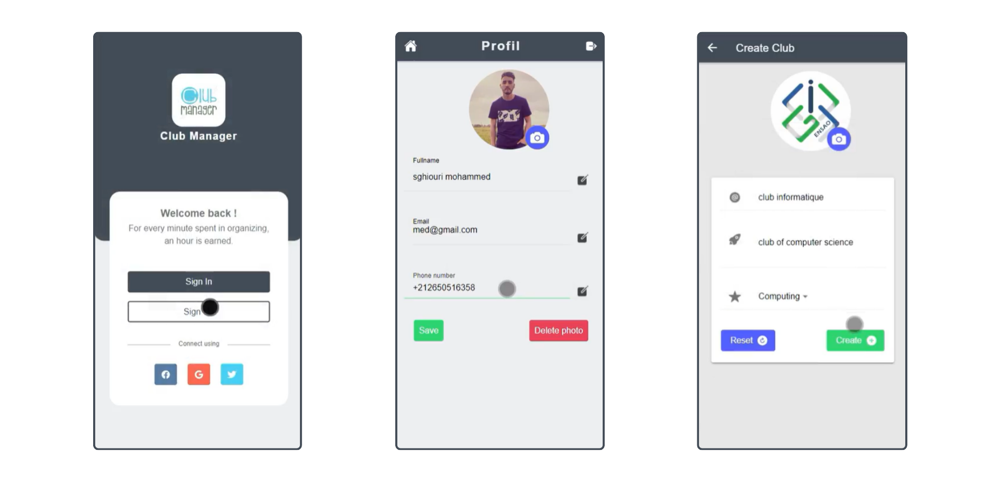
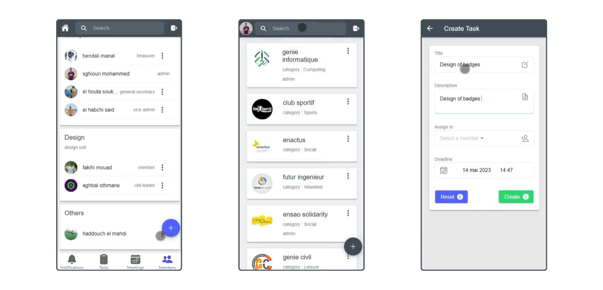

## ClubManager : Empower Your Club, Manage with Ease, Your Task Solution!
<!-- PROJECT LOGO -->
 

  

  <h3 align="center"> ✔️ ClubManager ✔️ </h3>

  

    "Club Manager" est une application mobile hybride dans le cadre faciliter la gestion de clubs en permettant à chaque utilisateur de créer ou
    de rejoindre des clubs et de gérer les tâches au sein du club. Cela inclut la création et
    l'affectation des tâches aux membres, ainsi que la planification des réunions. Les utilisateurs
    reçoivent également des notifications lorsqu'une tâche leur est affectée ou lorsqu'une réunion
    est organisée.
     
     
    <a target="_blank" href="https://drive.google.com/drive/folders/1iQRKdZBFc8rpf4Dl5opbdX2CiabqeyDD">
      <strong> 🔗 🔗 Consulter la VIDEO demo sur DRIVE 🔗 🔗</strong>
    </a>
     
  

  
  ### Overview
  
  

    
  

  

    
  

  ### Technologies
  

  

